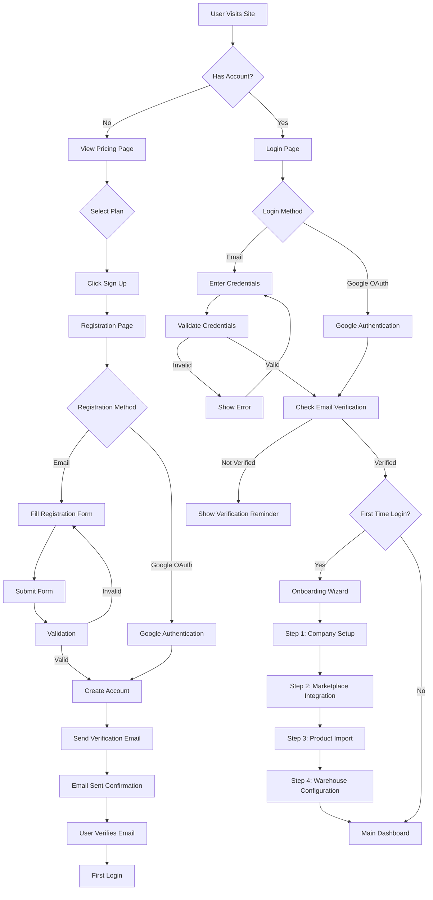
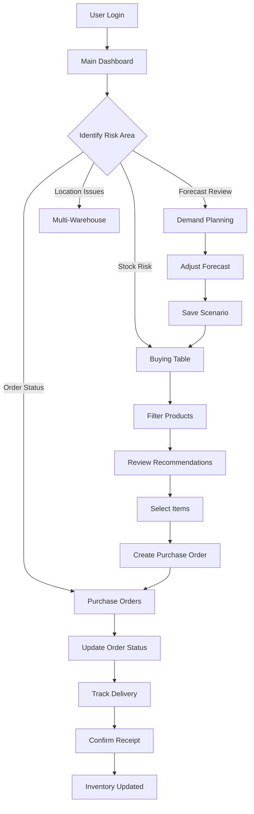
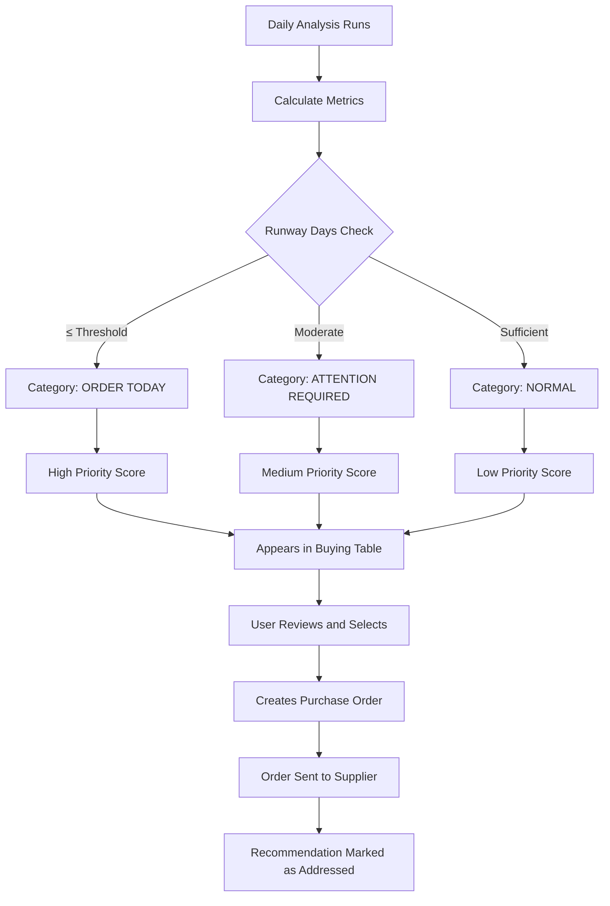
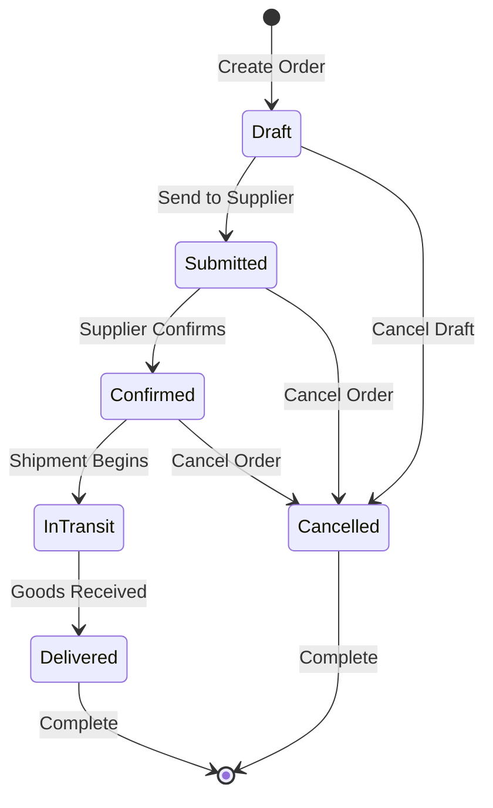

# Stock Planning Tool - Design Document

## Purpose and Value Proposition

This design document defines the strategic direction for transforming ForecastMP-v2 into a comprehensive operational stock planning tool. The system will enable marketplace sellers to manage their entire inventory lifecycle through a unified workspace that prioritizes actionable insights over static reporting.

The core value proposition centers on minimizing manual Excel workflows by automating the complete cycle: forecast → procurement planning → supplier order creation and tracking → post-execution analytics.

## Strategic Design Principles

### User Experience Philosophy

The system adopts an action-first approach where users enter the system not to view reports, but to identify which products are at risk and which orders need to be placed today. The interface prioritizes planning tables and procurement workflows over static visualizations.

### Key UX Objectives

- Provide a single workspace for all inventory decisions across forecasting, procurement, order fulfillment, and analytics
- Enable rapid transition from aggregated risk views to specific actions such as order creation
- Eliminate manual Excel processes by automating data collection, forecasting, requirement calculation, and document generation
- Support decisions through contextual information accessible within one or two clicks from primary screens

### Visual Design Direction

#### Design Aesthetic: Neo-Skeuomorphism and Modern Data-Driven Design

The interface adopts a clean, airy neo-skeuomorphic aesthetic that balances visual appeal with functional clarity:

- Abundant white space creating breathing room between interface elements
- Card-based layouts with soft shadows for logical information grouping
- Clear visual hierarchy ensuring the most critical information immediately captures attention
- Modern, technology-forward appearance that conveys professionalism and reliability

#### Color Palette

**Primary and Accent Colors**
- Primary Blue: #1890FF (Ant Design default) - Represents trust and technological sophistication
- Usage: Primary action buttons, active navigation links, important indicators and highlights

**Background Colors**
- Pure White: #FFFFFF - Primary background for cards and content areas
- Light Gray: #F5F5F5 - Page backgrounds and section separators

**Semantic Status Colors**
- Success/Healthy: Green #52C41A - Sufficient inventory, products in stock, normal operations
- Danger/Critical: Red #F5222D - Requires immediate attention, stockout situations
- Warning/Caution: Orange #FA8C16 - Low inventory, upcoming procurement needs
- Neutral/Disabled: Gray #BFBFBF - Inactive elements, disabled states

#### Typography

**Font Family**
- Primary: Inter or SF Pro Display (system font with web font fallback)
- Characteristics: Clean, highly readable, optimized for data-dense tables and dashboards

**Type Scale and Hierarchy**
- Page Headings: 24px - Major section titles
- Subheadings/Table Headers: 16px - Section headers and table column names
- Body Text: 14px - Primary content and table cells
- Supporting Text: 12px - Metadata, timestamps, helper text

**Font Weight Usage**
- Headings: Semi-bold (600) or Bold (700)
- Body: Regular (400)
- Emphasis: Medium (500)

### Design Pattern Consistency

The system will maintain consistent patterns across all screens:

- Unified filter panel placement at top or left of views
- Standardized health and risk badge formatting with semantic colors
- Consistent action button styling for operations like create order, export, and modify forecast
- Repeatable card templates with soft shadows for analytical screens
- Consistent spacing and padding using 8px grid system (8, 16, 24, 32px)
- Uniform border radius for cards and buttons (4-8px for subtle roundness)

## Technology Architecture Approach

### Django-First Monolithic Architecture

The system leverages Django's full-stack capabilities to maintain simplicity and avoid frontend-backend separation complexity. The neo-skeuomorphic design aesthetic is fully achievable with this approach.

**Backend Stack**
- Django 4.2+ as the core web framework
- Django Templates for server-side HTML rendering
- Django ORM with PostgreSQL for data persistence
- Celery with Redis for background task processing
- Django authentication extended with django-allauth for social login (Google OAuth)

**Frontend Integration**
- HTMX for dynamic interactions without complex JavaScript:
  - Table sorting, filtering, and pagination
  - Modal windows and drawers
  - Inline editing and form submissions
  - Real-time updates via server-sent events or polling
- Tailwind CSS for implementing neo-skeuomorphic design:
  - Utility classes for spacing, colors, shadows
  - Custom configuration for brand colors (#1890FF primary blue)
  - Responsive breakpoints and mobile-first design
  - Custom components via @apply directives
- Alpine.js (optional) for minimal client-side interactivity:
  - Dropdown menus
  - Tabs and accordions
  - Form validation feedback
- Reusable UI components through django-cotton or django-components:
  - Card components with soft shadows
  - Button variants (primary, secondary, danger)
  - Status badges
  - Navigation elements
  - Modal templates

**Why This Stack Works for Neo-Skeuomorphic Design**
- Tailwind CSS provides complete control over shadows, borders, and visual hierarchy
- HTMX enables smooth interactions that feel modern without SPA complexity
- Django templates allow component reusability while keeping logic server-side
- Custom CSS can add subtle animations and transitions for polish
- No build step complexity - simple development workflow for Python developers

**Integration Pattern**
- Django serves complete HTML pages with embedded interactivity
- HTMX attributes on elements trigger server requests and update page fragments
- Forms submit via HTMX, returning updated HTML snippets
- Django views return full pages or HTML partials depending on request headers
- Session-based authentication (csrf-protected) with optional token auth for API endpoints if needed

## Public Pages and Authentication Flow

### Landing and Marketing Pages

Before authenticated access, users interact with public-facing pages that communicate value and enable account creation.

#### Pricing Page

**Purpose**
Present subscription tiers clearly, enabling prospective customers to understand offering and select appropriate plan.

**Structure**

**Page Header**
- Main heading: "Choose Your Plan" or "Flexible Pricing for Every Business Size"
- Subheading explaining value proposition
- Toggle for billing period: Monthly vs Annual (with discount indication for annual)

**Pricing Card Grid**
Four pricing tiers displayed as cards with soft shadow, arranged horizontally:

**Tier 1: Start (Starter)**
- Target: Small sellers or new businesses testing the platform
- Pricing: Lowest tier (e.g., Free or minimal monthly fee)
- Feature highlights:
  - Single marketplace integration
  - Up to 100 SKUs
  - Basic forecasting (simple mean-based)
  - Weekly reports
  - Email support
- Visual treatment: White card with gray border
- Call-to-action: "Start Free" or "Try Start Plan"

**Tier 2: Mini**
- Target: Growing businesses with moderate catalog
- Pricing: Mid-low tier
- Feature highlights:
  - Up to 2 marketplace integrations
  - Up to 500 SKUs
  - AI-powered forecasting
  - Multi-warehouse support (up to 3 locations)
  - Daily reports and alerts
  - Priority email support
- Visual treatment: White card with subtle blue accent border
- Call-to-action: "Choose Mini"

**Tier 3: Pro (Most Popular)**
- Target: Established businesses with significant inventory operations
- Pricing: Mid-high tier
- Feature highlights:
  - Unlimited marketplace integrations
  - Up to 2,000 SKUs
  - Advanced AI forecasting with seasonality
  - Unlimited warehouses
  - Real-time inventory sync
  - Telegram notifications
  - Custom reports and analytics
  - Priority support with dedicated account manager
- Visual treatment: Card with blue background (#1890FF) and white text, or white card with prominent blue border and "Popular" badge
- Call-to-action: "Choose Pro" (primary styled button)

**Tier 4: Enterprise**
- Target: Large organizations with complex requirements
- Pricing: Custom pricing ("Contact Us")
- Feature highlights:
  - Unlimited SKUs
  - Custom integrations (ERP, WMS, 3PL)
  - White-label options
  - API access for custom development
  - Dedicated infrastructure
  - SLA guarantees
  - On-site training and onboarding
  - 24/7 premium support
- Visual treatment: White card with gold or dark accent
- Call-to-action: "Contact Sales"

**Feature Comparison Table**
Below pricing cards, detailed comparison table showing all features across tiers with checkmarks, X marks, or specific limits.

**FAQ Section**
Common questions about billing, plan changes, data migration, trial periods.

#### Authentication Pages

**Login Page**

**Layout**
- Centered card on light gray background (#F5F5F5)
- Card with white background and soft shadow
- Logo and application name at top

**Elements**
- Heading: "Sign In to Your Account"
- Email input field with label "Email Address"
- Password input field with label "Password" and show/hide toggle
- "Remember me" checkbox
- "Forgot password?" link aligned right
- Primary action button: "Sign In" (blue #1890FF, full width)
- Divider with "OR" text
- Social authentication button: "Sign in with Google" (Google brand colors, with logo icon)
- Footer text: "Don't have an account?" with "Sign Up" link

**Validation and Error Handling**
- Inline validation messages below fields
- Error message display for invalid credentials with red (#F5222D) styling

**Registration Page**

**Layout**
- Similar centered card layout as login
- White card with soft shadow on light gray background

**Elements**
- Heading: "Create Your Account"
- Form fields:
  - Full Name (text input)
  - Email Address (email input with validation)
  - Password (password input with strength indicator)
  - Confirm Password (password input with match validation)
  - Company Name (text input)
  - Agree to Terms checkbox with link to terms of service
- Primary action button: "Create Account" (blue #1890FF, full width)
- Divider with "OR" text
- Social authentication button: "Sign up with Google"
- Footer text: "Already have an account?" with "Sign In" link

**Password Strength Indicator**
Visual bar below password field showing strength level:
- Weak: Red bar, 25% fill
- Fair: Orange bar, 50% fill
- Good: Light green bar, 75% fill
- Strong: Green (#52C41A) bar, 100% fill

**Email Verification Flow**
After registration, user receives verification email. Unverified users see banner prompting email confirmation on first login.

**Forgot Password Page**

**Layout**
- Centered card layout

**Elements**
- Heading: "Reset Your Password"
- Instruction text: "Enter your email address and we'll send you a link to reset your password"
- Email input field
- Primary action button: "Send Reset Link"
- Back to login link

**Success State**
After submission, show confirmation message: "Check your email for reset instructions"

**Password Reset Page (from email link)**

**Elements**
- Heading: "Create New Password"
- New Password field with strength indicator
- Confirm New Password field
- Primary action button: "Reset Password"

**Visual Consistency Across Auth Pages**
- All pages use same card dimensions (max-width: 400px)
- Consistent spacing and padding (24px internal padding)
- Same button styling and hover states
- Unified error and success message styling
- Responsive design for mobile devices

## Navigation Structure

The navigation system for authenticated users will be organized as a left vertical sidebar or top horizontal navigation bar with logically grouped sections:

### Primary Navigation Sections

#### Main Dashboard and Analytics
Provides aggregate metrics across sales, stock levels, and risk indicators including Net Sales, Net Quantity, AOV, Stock Out percentage, Excess Stock percentage, and Days Left metrics.

#### Demand Planning
Interface for selecting planning methodology (simple mean-based or AI-powered), configuring forecast horizon and seasonality parameters, and manually adjusting forecast values.

#### Buying Table
Primary operational screen displaying SKU-level health status, recommended purchase dates and quantities, costs, and key performance indicators. Serves as the starting point for order creation workflows.

#### Purchase Orders to Suppliers
Comprehensive view of all supplier orders with filters by status (draft, sent, in transit, received), ability to open specific orders, and functionality to update order statuses.

#### Multi-Warehouse and Locations
Management interface for stock across warehouses and stores, including internal transfer planning and stock distribution optimization.

#### Settings and Integrations
Configuration hub for marketplace connections, WMS and 3PL integrations, forecast parameters, lead times, MOQ values, currencies, user permissions, and subscription management.

#### Account and Billing
Subscription plan management, billing history, payment method configuration, plan upgrade or downgrade options, and usage statistics relative to plan limits.

## Main Dashboard and Analytics

### Strategic Purpose

The dashboard provides immediate visibility into business inventory health through sales performance, turnover rates, stockout and overstock risk levels, and key trends. It serves as the entry point where users drill down into inventory views, buying tables, and category or supplier analytics.

### Dashboard Structure

#### Top KPI Panel

Display primary metrics including Net Sales, Net Quantity, Average Order Value, Stock Out percentage, Excess Stock percentage, and Average Days Left. Support period switching (day, week, month) with comparison to previous period.

#### Visualization Blocks

Present sales and stock trends over time, inventory distribution breakdowns by location, category, and health status.

#### Contextual Navigation Links

Provide direct access from widgets to detailed views: view at-risk products, open inventory views, navigate to planning or buying tables.

## Demand Planning and Forecast

### Strategic Purpose

Enable users to generate demand forecasts by SKU or category for a defined horizon (3 to 12 months) incorporating seasonality and trends, with capability for manual adjustments. Acts as the bridge between historical data and operational procurement decisions.

### Planning Interface Structure

#### Planning Mode Selection

Choose between simple mode (mean or naive forecasting) and intelligent mode (AI-powered forecast with seasonality, growth patterns, and channel considerations).

#### Forecast Table

Display products or SKUs as rows with attributes including name, category, brand, and supplier. Columns represent time periods (months or weeks) showing forecasted sales with inline editing capability for manual adjustments.

#### Filter Panel

Enable filtering by collections, categories, locations, tags, and sales channels with support for saved view templates.

#### Action Controls

Provide controls to apply forecast, refresh forecast calculations, and save forecast scenarios for use in buying table generation.

## Buying Table (Procurement Planning)

### Strategic Purpose

The buying table is the primary operational screen for category managers and buyers to identify SKUs requiring procurement, assess each position's health status, and make purchasing decisions. It enables the fastest possible transition from analytical filtering to actionable order creation.

### Table Structure

#### Filter and View Configuration Panel

Support selection of planning period, filtering by category, supplier, location, channel, and health status (Out of Stock, At Risk, Healthy, Overstock). Include saved view presets.

#### Primary Data Table

##### Core Columns

- Product and SKU information with mini-card showing name, image, and brand
- Current availability and Days of Cover
- Demand forecast for the planning period
- Health status with color-coded badge and descriptive text such as "Risk of Stockout in 7 days"
- Recommended order date and recommended quantity to buy with purchase cost

##### Extended Columns (Optional Display)

- Lead time, MOQ, pack size
- Margin, revenue, new customer sales share
- Additional operational metrics configurable by user

##### Interactive Features

Hover tooltips on status and metrics explaining calculation methodology and risk reasoning.

#### Action Panel

Provide bulk row selection via checkboxes, create order button to generate one or multiple supplier orders from selected items, and capability to save and share current view configuration with colleagues.

## Purchase Orders to Suppliers

### Strategic Purpose

Manage the complete lifecycle of supplier purchase orders from creation based on buying table selections through delivery and stock synchronization. Provide transparency across order statuses including which orders are sent, in transit, overdue, or received.

### Order Management Structure

#### Order List View

Display orders in table format with columns for status, total amount, creation date, estimated time of arrival, actual receipt date, and SKU count per order. Filter by status (Draft, Sent, In Transit, Received, Cancelled), supplier, location, and date ranges (ETA or creation date).

#### Order Detail Card

##### Header Section
Display supplier details, warehouse or location, currency, order number, and current status.

##### Line Items Table
Show SKU, order quantity, unit price, total cost per line, and MOQ and pack size considerations.

##### Action Controls
Support status changes, additional cost entries, export or email to supplier, and comment management.

## Multi-Warehouse and Transfer Management

### Strategic Purpose

Provide unified control over inventory across all locations including stores, warehouses, and fulfillment centers. Enable internal transfer planning to prevent situational overstock or stockout caused by uneven inventory distribution.

### Multi-Location Structure

#### Location Overview

Display inventory breakdown by warehouse or store showing aggregate stock levels, Days of Cover, and status indicators per location.

#### Transfer Management Table

List internal movements with columns for origin location, destination location, date, status, SKU count, and total value.

#### Location Detail View

For each location, display SKU-level inventory with current stock, forecast, and recommendations for either external procurement or internal transfer from another location.

## Analytics and Reporting

### Strategic Purpose

Deliver extended analytics across sales, inventory, procurement effectiveness, supplier performance, and other business dimensions. Provide source for comprehensive and exportable reports supporting strategic business objectives including forecast accuracy evaluation, stockout and overstock analysis, and supplier assessment.

### Reporting Structure

#### Report Templates

Offer over 20 pre-built report templates covering sales, inventory, procurement, raw materials, suppliers, and locations.

#### Common Report Interface

##### Filter Controls
Period selection, location filters, collection and channel selectors.

##### Data Presentation
Primary table or charts with adjustable grouping by SKU, category, or supplier.

##### Export and Subscription
Buttons for CSV and PDF export, report saving, and subscription setup for recurring delivery.

## Settings and Integration Management

### Strategic Purpose

Configure the system for specific business requirements including marketplace connections, forecast parameter tuning, procurement business logic (lead time, MOQ, safety stock), user access management, and subscription plan administration. Ensure correct data synchronization with external systems including marketplaces, WMS, and 3PL providers.

### Configuration Structure

#### Integration Hub

Display connected marketplaces, platforms, and warehouse systems with synchronization status, update frequency, and settings such as primary warehouse designation.

#### Planning Parameters

Configure global forecast horizon, forecasting methodology (AI or simple), and default values for lead time, MOQ, and safety stock.

#### User and Permission Management

Manage user roster with role assignments (owner, buyer, analyst) and access controls determining who can modify forecasts, create orders, and configure integrations.

#### Subscription and Billing Management

**Purpose**
Provide transparency into current subscription status, enable plan changes, and manage billing information.

**Current Plan Overview Card**
- Display current plan name (Start, Mini, Pro, Enterprise)
- Plan features summary with usage indicators
- Billing cycle (monthly or annual)
- Next billing date and amount
- Usage metrics against plan limits:
  - SKU count: Current / Limit (e.g., "347 / 500 SKUs")
  - Marketplace integrations: Current / Limit
  - Warehouse count: Current / Limit
  - Visual progress bar showing percentage of limit used
  - Color coding: Green if under 70%, Orange if 70-90%, Red if over 90%

**Plan Actions**
- Button: "Upgrade Plan" (if not on highest tier)
- Button: "Change Plan" (opens plan comparison modal)
- Link: "Cancel Subscription" (with confirmation dialog)

**Billing History Table**
Columns: Invoice Date, Description, Amount, Status (Paid/Pending/Failed), Download Invoice (PDF link)

**Payment Method Section**
- Display current payment method (masked card number or payment type)
- Button: "Update Payment Method"
- Supported payment methods display (cards, bank transfer for Enterprise)

**Plan Comparison Modal**
When user clicks change plan, modal displays:
- Side-by-side comparison of all four tiers
- Current plan highlighted
- Feature checkmarks and limits for each tier
- Pricing for selected billing cycle
- Buttons: "Select Plan" for each tier
- Confirmation step showing proration details if applicable

## Data Model Strategic Concepts

### Core Entities

#### Company
Tenant entity representing organization with subscription plan association, billing information, and plan usage tracking.

#### User
Individual user account with email, password hash, company association, role assignment, email verification status, and OAuth provider linkage (Google).

#### Subscription
Subscription management entity with company reference, plan tier (Start, Mini, Pro, Enterprise), billing cycle (monthly or annual), status (active, cancelled, past_due, trial), start and end dates, and payment method information.

#### Plan Limit Tracking
Usage tracking entity recording current consumption against plan limits including active SKU count, marketplace integration count, warehouse count, and API request count for rate limiting.

#### Product
Central catalog entity with SKU identifier, descriptive attributes, cost and pricing information, category and brand classification, and supplier associations.

#### Warehouse
Physical or fulfillment location entity with type classification (own warehouse or marketplace fulfillment), marketplace association for fulfillment centers, and primary warehouse designation.

#### Sales Transaction
Individual sale records with product reference, marketplace source, sale date, quantity and revenue, transaction reference for idempotency, and extensible metadata.

#### Inventory Snapshot
Point-in-time inventory state with product and warehouse reference, snapshot date, available and reserved quantities.

#### Forecast Result
Demand prediction output with product reference, forecast date range, predicted quantities per period, confidence intervals, and generation metadata.

#### Procurement Recommendation
Actionable procurement suggestion with product reference, analysis date, current stock and burn rate metrics, runway days and stockout prediction, recommended purchase quantity and timing, action category (Order Today, Already Ordered, Attention Required, Normal), and priority scoring.

#### Purchase Order
Supplier order entity with order number and dates (order, expected delivery, actual delivery), status workflow (Draft, Sent, In Transit, Received, Cancelled), supplier information, and associated line items.

#### Purchase Order Item
Individual line within purchase order with product reference, ordered and received quantities, unit cost, and notes.

### Key Relationships

- Companies have one Subscription and many Users
- Users belong to one Company and authenticate via email/password or OAuth (Google)
- Subscription defines Plan Limits enforced throughout the application
- Products belong to Company and have many Sales Transactions, Inventory Snapshots, Forecasts, and Procurement Recommendations
- Warehouses belong to Company and contain Inventory Snapshots
- Purchase Orders belong to Company and contain multiple Purchase Order Items
- Procurement Recommendations link to Products and inform Purchase Order creation
- Forecasts feed into Procurement Recommendation calculations

## Business Logic Flows

### Subscription and Plan Enforcement

#### Plan Limits Definition

**Start Plan Limits**
- Maximum SKUs: 100
- Marketplace integrations: 1
- Warehouses: 1
- Forecasting: Simple mean-based only
- Report frequency: Weekly
- User seats: 1-2

**Mini Plan Limits**
- Maximum SKUs: 500
- Marketplace integrations: 2
- Warehouses: 3
- Forecasting: AI-powered available
- Report frequency: Daily
- User seats: 3-5

**Pro Plan Limits**
- Maximum SKUs: 2,000
- Marketplace integrations: Unlimited
- Warehouses: Unlimited
- Forecasting: Advanced AI with seasonality
- Report frequency: Real-time
- User seats: 10-20
- Additional features: Telegram notifications, custom reports

**Enterprise Plan Limits**
- All limits: Unlimited or custom negotiated
- Custom integrations available
- White-label options
- API access
- SLA guarantees

#### Limit Enforcement Logic

**Product Creation Validation**
When user attempts to create new product:
1. Query current active product count for company
2. Retrieve company subscription plan limit
3. If current count >= limit, reject creation with message: "You've reached your plan limit of [X] SKUs. Upgrade your plan to add more products."
4. Display upgrade prompt with link to billing settings

**Marketplace Integration Validation**
When user attempts to add marketplace connection:
1. Count existing active integrations
2. Compare against plan limit
3. If at limit, prevent addition and show upgrade message

**Warehouse Creation Validation**
Similar pattern checking warehouse count against plan limit.

**Forecasting Method Restriction**
If user on Start plan attempts to select AI forecasting:
- Disable AI forecasting option in UI
- Show tooltip: "AI forecasting available on Mini plan and above"
- Display upgrade button

**Soft Limit Warnings**
When usage reaches 80% of plan limit:
- Display banner notification: "You're approaching your plan limit. Consider upgrading."
- Send email notification to account owner

When usage reaches 90%:
- Display more prominent warning
- Suggest specific higher tier plan

#### Trial Period Logic

**New Registration Flow**
- All new accounts start with 14-day trial of Pro plan
- Trial countdown displayed in UI header
- Email reminders sent at 7 days, 3 days, and 1 day remaining
- At trial end, account downgrades to Start plan unless payment method added

### Daily Automated Workflow

#### Morning Synchronization (6:00 AM)
Fetch latest sales, inventory, and product data from all connected marketplaces (Wildberries, Ozon, custom integrations). Update internal database with new transactions and inventory snapshots.

#### Forecast Generation (7:00 AM)
For each active product, analyze historical sales patterns (60-180 days), apply selected forecasting methodology (mean-based or AI model), generate predictions for configured horizon (7-30 days), and save forecast results with confidence levels.

#### Procurement Analysis (7:30 AM)
For each product, retrieve current inventory levels, calculate daily burn rate from recent sales, compute runway days and predicted stockout date, determine recommended order quantity based on lead time and MOQ, categorize urgency (Order Today, Attention Required, Normal), and save procurement recommendations with priority scores.

### User-Initiated Workflows

#### Forecast Adjustment Workflow
User accesses demand planning screen, reviews system-generated forecasts, applies manual adjustments to specific SKUs or periods based on business knowledge (promotions, seasonality, market changes), saves adjusted forecast scenario, and system recalculates procurement recommendations based on new forecast.

#### Purchase Order Creation Workflow
User opens buying table, applies filters to identify target products (category, supplier, risk status), reviews health indicators and recommended quantities, selects products via checkboxes, initiates order creation, system groups selected items by supplier, generates draft purchase orders with line items, user reviews and adjusts quantities if needed, adds supplier-specific information, submits order (status changes to Sent), and system optionally exports order document or sends to supplier email.

#### Order Tracking Workflow
User accesses purchase orders screen, filters by status or supplier, opens specific order detail, reviews line items and delivery dates, updates order status as it progresses (Confirmed, In Transit, Delivered), records actual delivery date, and upon delivery, system updates inventory snapshots and marks recommendations as fulfilled.

#### Multi-Location Transfer Workflow
User identifies SKU with uneven distribution (overstock in location A, stockout risk in location B), creates internal transfer order specifying source and destination warehouses, defines quantities to transfer, submits transfer, system creates inventory movement records, updates inventory snapshots for both locations, and recalculates procurement recommendations reflecting new distribution.

## User Interface Workflow Diagrams

### Authentication and Onboarding Flow



### High-Level User Journey



### Procurement Decision Flow



### Order Lifecycle State Machine



## Key Metrics and Calculations

### Inventory Health Metrics

#### Days of Cover (Runway Days)
Calculation: Current Stock ÷ Daily Burn Rate

Interpretation: Number of days until stockout at current sales velocity. Values below lead time threshold trigger Order Today recommendation.

#### Stock Out Percentage
Calculation: (Products with Zero Stock ÷ Total Active Products) × 100

Interpretation: Proportion of catalog currently unavailable. High percentages indicate systematic procurement issues.

#### Excess Stock Percentage
Calculation: (Products with Runway > Maximum Threshold ÷ Total Active Products) × 100

Interpretation: Proportion of catalog with excessive inventory. High percentages indicate capital inefficiency.

#### Daily Burn Rate
Calculation: Sum of Sales Quantities over Analysis Period ÷ Number of Days in Period

Interpretation: Average daily sales velocity used for runway and forecast calculations.

### Procurement Metrics

#### Recommended Order Quantity
Calculation: (Daily Burn Rate × (Lead Time Days + Safety Buffer Days)) - Current Stock - Quantity in Existing Orders

Interpretation: Quantity to purchase accounting for lead time, desired safety stock, and pending deliveries.

#### Priority Score
Calculation: Urgency Factor (based on runway days) × Revenue Impact Factor × Stock Health Factor

Interpretation: Composite score ranging 0-100 determining recommendation sort order. Higher scores indicate more urgent procurement needs.

### Performance Metrics

#### Forecast Accuracy (MAPE)
Calculation: Average of |Actual Sales - Forecasted Sales| ÷ Actual Sales × 100 across all products

Interpretation: Lower percentage indicates better forecast precision. Target thresholds typically below 20-30% for reliable planning.

#### Inventory Turnover
Calculation: Total Sales in Period ÷ Average Inventory Level

Interpretation: How many times inventory sells through in a period. Higher values indicate efficient capital utilization.

## Health Status Classification Logic

### Status: Out of Stock
Condition: Current Stock = 0

Visual: Red badge

Action: Immediate procurement required

### Status: At Risk (Critical)
Condition: Runway Days ≤ Lead Time Days

Visual: Red badge with countdown

Action: Order Today recommendation

### Status: At Risk (Warning)
Condition: Runway Days ≤ (Lead Time Days + Safety Buffer Days)

Visual: Yellow badge

Action: Attention Required recommendation

### Status: Healthy
Condition: Runway Days > (Lead Time Days + Safety Buffer Days) AND Runway Days ≤ Maximum Inventory Days

Visual: Green badge

Action: Normal, no action needed

### Status: Overstock
Condition: Runway Days > Maximum Inventory Days

Visual: Orange badge

Action: Review demand forecast or reduce future orders

## UI Component Design Specifications

### Card Component

The card is the fundamental building block for grouping related information in neo-skeuomorphic style.

**Visual Properties**
- Background: White (#FFFFFF)
- Border: None or subtle 1px solid #F0F0F0
- Border radius: 8px for soft corners
- Shadow: Soft shadow for depth - `box-shadow: 0 2px 8px rgba(0, 0, 0, 0.08)`
- Padding: 24px internal spacing
- Margin: 16px between cards

**Tailwind CSS Implementation**
```
Class combination: bg-white rounded-lg shadow-md p-6 hover:shadow-lg transition-shadow duration-300
```

**Django Template Component Example**
Using django-cotton or include tag:
```
<!-- card.html template -->
<div class="bg-white rounded-lg shadow-md p-6 hover:shadow-lg transition-shadow duration-300">
    {{ slot }}
</div>
```

**Hover State**
- Shadow elevation: `box-shadow: 0 4px 16px rgba(0, 0, 0, 0.12)`
- Transition: smooth 0.3s ease-in-out
- Subtle upward lift effect (transform: translateY(-2px))

**Usage Contexts**
- Dashboard metric cards
- Pricing plan cards
- Authentication forms
- Settings sections
- Detail views and modals

### Button Component

**Primary Button (Call-to-Action)**
- Background: Blue #1890FF
- Text color: White #FFFFFF
- Font weight: 500 (Medium)
- Padding: 8px 16px (small), 12px 24px (medium), 16px 32px (large)
- Border radius: 4px
- Shadow: `box-shadow: 0 2px 4px rgba(24, 144, 255, 0.2)`
- Hover state: Darker blue #096DD9, elevated shadow
- Active state: Even darker #0050B3
- Disabled state: Gray #D9D9D9, no shadow, cursor not-allowed

**Tailwind CSS Implementation**
```
Class: bg-blue-500 hover:bg-blue-600 active:bg-blue-700 text-white font-medium py-3 px-6 rounded shadow-sm hover:shadow-md transition-all duration-200 disabled:bg-gray-300 disabled:cursor-not-allowed
```

**Django Template with HTMX**
```
<button 
    hx-post="/api/create-order/" 
    hx-target="#order-list"
    class="bg-blue-500 hover:bg-blue-600 text-white font-medium py-3 px-6 rounded shadow-sm hover:shadow-md transition-all duration-200">
    
</button>
```

**Secondary Button**
- Background: White #FFFFFF
- Border: 1px solid #D9D9D9
- Text color: #262626 (dark gray)
- Hover state: Background #FAFAFA, border #1890FF

**Tailwind CSS Implementation**
```
Class: bg-white border border-gray-300 hover:border-blue-500 hover:bg-gray-50 text-gray-800 font-medium py-3 px-6 rounded transition-all duration-200
```

**Danger Button**
- Background: Red #F5222D
- Text color: White
- Used for destructive actions (delete, cancel subscription)

**Ghost Button**
- No background or border in default state
- Text color: #1890FF
- Hover state: Light blue background #E6F7FF

### Status Badge Component

**Visual Design**
- Inline badge: pill-shaped with border-radius: 12px
- Padding: 4px 12px
- Font size: 12px
- Font weight: 500

**Status Color Mapping**

**Healthy / Success / Normal**
- Background: Light green #F6FFED
- Border: 1px solid #B7EB8F
- Text: Green #52C41A
- Icon: Checkmark circle

**Critical / Danger / Out of Stock**
- Background: Light red #FFF1F0
- Border: 1px solid #FFCCC7
- Text: Red #F5222D
- Icon: Alert triangle or exclamation

**Warning / At Risk**
- Background: Light orange #FFF7E6
- Border: 1px solid #FFD591
- Text: Orange #FA8C16
- Icon: Warning triangle

**Neutral / Disabled**
- Background: Light gray #FAFAFA
- Border: 1px solid #D9D9D9
- Text: Gray #8C8C8C

### Data Table Component

**Table Structure**
- Header background: Light gray #FAFAFA
- Header text: Bold 14px, color #262626
- Row background: White, alternating rows optional with #FAFAFA
- Row hover: Light blue #E6F7FF
- Border: 1px solid #F0F0F0 between rows
- Cell padding: 12px 16px

**Sortable Columns**
- Sort icon: Up/down arrows in header
- Active sort: Blue #1890FF icon
- Hover: Show sort icon on hover

**Action Columns**
- Right-aligned
- Icon buttons for edit, delete, view details
- Hover reveals actions if space-constrained

### Input Field Component

**Text Input**
- Border: 1px solid #D9D9D9
- Border radius: 4px
- Padding: 8px 12px
- Font size: 14px
- Focus state: Border #1890FF, subtle blue shadow
- Error state: Border #F5222D, red helper text below
- Success state: Border #52C41A (optional for validation)

**Label**
- Font size: 14px
- Font weight: 500
- Color: #262626
- Margin bottom: 8px
- Required indicator: Red asterisk

**Helper Text**
- Font size: 12px
- Color: #8C8C8C (neutral), #F5222D (error), #52C41A (success)
- Margin top: 4px

### Modal Component

**Overlay**
- Background: rgba(0, 0, 0, 0.45) - semi-transparent black
- Blur effect optional: backdrop-filter: blur(4px)

**Modal Card**
- Background: White #FFFFFF
- Border radius: 8px
- Shadow: `box-shadow: 0 8px 32px rgba(0, 0, 0, 0.16)`
- Max width: 520px (small), 720px (medium), 960px (large)
- Padding: 24px

**Django Template with HTMX Modal**
```
<!-- Modal trigger -->
<button 
    hx-get="/products/{{ product.id }}/edit/"
    hx-target="#modal-container"
    hx-swap="innerHTML"
    class="text-blue-500 hover:text-blue-600">
    
</button>

<!-- Modal container -->
<div id="modal-container"></div>

<!-- Modal template returned by HTMX -->
<div class="fixed inset-0 bg-black bg-opacity-45 flex items-center justify-center z-50" 
     x-data="{ open: true }" 
     x-show="open"
     x-transition>
    <div class="bg-white rounded-lg shadow-2xl max-w-2xl w-full mx-4 p-6">
        <!-- Modal header -->
        <div class="flex justify-between items-center border-b pb-4 mb-4">
            <h2 class="text-xl font-semibold"></h2>
            <button @click="open = false" class="text-gray-500 hover:text-gray-800">
                <svg class="w-6 h-6"><!-- X icon --></svg>
            </button>
        </div>
        
        <!-- Modal body -->
        <div class="py-4">
            <!-- Form content -->
        </div>
        
        <!-- Modal footer -->
        <div class="flex justify-end gap-3 border-t pt-4">
            <button @click="open = false" class="bg-white border border-gray-300 hover:bg-gray-50 px-6 py-2 rounded">
                
            </button>
            <button hx-post="..." class="bg-blue-500 hover:bg-blue-600 text-white px-6 py-2 rounded">
                
            </button>
        </div>
    </div>
</div>
```

**Modal Header**
- Title: 18px, font-weight 600
- Close button: X icon in top-right, color #8C8C8C, hover #262626
- Border bottom: 1px solid #F0F0F0
- Padding bottom: 16px

**Modal Body**
- Padding: 24px 0
- Content area with scrolling if needed

**Modal Footer**
- Border top: 1px solid #F0F0F0
- Padding top: 16px
- Buttons aligned right
- Primary action button + secondary cancel button

### Progress Bar Component

**Usage Indicator (Plan Limits)**
- Height: 8px
- Border radius: 4px
- Background: Light gray #F0F0F0
- Fill color based on percentage:
  - 0-70%: Green #52C41A
  - 71-90%: Orange #FA8C16
  - 91-100%: Red #F5222D
- Smooth transition on value change
- Percentage text above bar: 12px, color matches fill

### Navigation Sidebar

**Sidebar Container**
- Width: 240px (expanded), 64px (collapsed)
- Background: White #FFFFFF or very light gray #FAFAFA
- Border right: 1px solid #F0F0F0
- Shadow: Subtle `box-shadow: 2px 0 8px rgba(0, 0, 0, 0.04)`

**Menu Item**
- Padding: 12px 16px
- Font size: 14px
- Color: #262626 (inactive), #1890FF (active)
- Background: Transparent (inactive), #E6F7FF (active)
- Hover: Background #F5F5F5
- Icon + text layout with 12px gap
- Active indicator: 3px blue bar on left edge

**Section Headers**
- Font size: 12px
- Font weight: 600
- Color: #8C8C8C
- Text transform: uppercase
- Padding: 8px 16px
- Margin top: 16px

### Filter Panel Component

**Panel Container**
- Background: Light gray #FAFAFA or white card
- Border: 1px solid #F0F0F0 or card shadow
- Padding: 16px
- Border radius: 8px if standalone, 0 if integrated

**Filter Row**
- Display: flex layout with gap: 12px
- Label + input/select pairs
- Wrap on smaller screens

**Filter Actions**
- "Apply Filters" primary button
- "Reset" secondary button
- "Save View" ghost button
- Right-aligned or bottom-aligned

### Notification Toast Component

**Toast Container**
- Position: Fixed top-right
- Width: 320px
- Border radius: 8px
- Shadow: `box-shadow: 0 4px 16px rgba(0, 0, 0, 0.16)`
- Padding: 16px
- Auto-dismiss: 4-6 seconds
- Slide-in animation from right

**Toast Variants**

**Success**
- Background: White
- Left border: 4px solid #52C41A
- Icon: Checkmark circle in green

**Error**
- Background: White
- Left border: 4px solid #F5222D
- Icon: Error circle in red

**Warning**
- Background: White
- Left border: 4px solid #FA8C16
- Icon: Warning triangle in orange

**Info**
- Background: White
- Left border: 4px solid #1890FF
- Icon: Info circle in blue

## Filter and View Management

### Standard Filter Dimensions

All major table views (Buying Table, Purchase Orders, Analytics) support filtering by:

- Time Period: Date ranges for analysis or order placement
- Category and Subcategory: Product classification hierarchy
- Supplier: Vendor associations
- Location and Warehouse: Physical or fulfillment location
- Marketplace Channel: Wildberries, Ozon, Website, or All
- Health Status: Out of Stock, At Risk, Healthy, Overstock
- Tags and Collections: User-defined product groupings

### Saved Views

Users can persist filter combinations and column configurations as named views, share views with team members via link or permission grants, and set default views to load automatically on screen access.

## Export and Integration Capabilities

### Export Formats

#### Excel (XLSX)
Use Cases: Buying tables, procurement recommendations, order lists

Features: Formatted tables with headers, formulas for calculations, multiple sheets for related data

#### PDF
Use Cases: Purchase order documents, executive reports

Features: Formatted layouts with company branding, tables and charts, pagination and headers

#### CSV
Use Cases: Raw data export for external analysis

Features: Plain text format for all tabular data

### Integration Patterns

#### Inbound Integrations (Data Collection)

Marketplace APIs (Wildberries, Ozon): Scheduled synchronization (typically daily at 6:00 AM) pulling sales transactions, inventory snapshots, and product catalog updates.

WMS and 3PL Systems: Real-time or scheduled inventory level updates, order fulfillment status, and warehouse transfer confirmations.

Custom Website Webhooks: Event-driven order notifications and inventory adjustments.

#### Outbound Integrations (Action Distribution)

Email: Purchase order documents sent to suppliers on order submission.

Telegram Notifications: Critical alerts for stockouts, daily digest summaries, and weekly performance reports.

Future Considerations: Direct ERP integration for purchase order submission, accounting system synchronization for cost tracking.

## Responsive Design and Mobile Adaptations

### Breakpoint Strategy

The interface adapts across device sizes using standard breakpoints:

**Mobile (xs)**
- Screen width: < 576px
- Single column layouts
- Collapsed navigation to hamburger menu
- Simplified tables with horizontal scroll or card view

**Tablet (sm)**
- Screen width: 576px - 768px
- Two-column layouts where appropriate
- Sidebar can collapse to icon-only
- Tables with fewer columns visible by default

**Desktop (md)**
- Screen width: 768px - 992px
- Standard multi-column layouts
- Full sidebar navigation
- Complete table views

**Large Desktop (lg)**
- Screen width: 992px - 1200px
- Optimized spacing and whitespace
- All features fully accessible

**Extra Large (xl)**
- Screen width: > 1200px
- Maximum content width with centered layout
- Enhanced data density options

### Mobile-Specific Adaptations

#### Authentication Pages on Mobile
- Full-width cards with reduced padding (16px vs 24px)
- Larger touch targets for buttons (minimum 44px height)
- Stacked social login buttons
- Single-column form layouts

#### Dashboard on Mobile
- KPI cards stack vertically
- Charts resize to full width
- Tap to expand metric details
- Swipeable card carousel for multiple metrics

#### Buying Table on Mobile
- Switch to card view instead of table
- Each product as expandable card showing:
  - Product image and name
  - Health status badge
  - Key metrics (stock, days left)
  - Tap to expand for full details
- Filter panel as bottom sheet or full-screen modal
- Bulk selection via long-press gesture

#### Purchase Orders on Mobile
- List view with summary cards
- Tap to view full order details
- Status change via action sheet
- Simplified forms with progressive disclosure

#### Navigation on Mobile
- Bottom navigation bar for primary sections (5 items max)
- Hamburger menu for secondary navigation
- Swipe gestures for quick navigation between related screens

### Touch Optimization

- Minimum touch target size: 44x44px
- Adequate spacing between interactive elements (minimum 8px)
- Clear visual feedback on tap (ripple effect or color change)
- Avoid hover-dependent interactions
- Support swipe gestures where appropriate (delete, refresh)

## Security and Access Control

### Authentication
Standard Django session-based authentication with email and password credentials.

### Multi-Tenancy and Data Isolation
All data models include company foreign key ensuring logical separation. Query-level filtering enforces users can only access their company's data.

### Role-Based Permissions

#### Owner Role
Full system access including configuration changes, integration management, user administration, and all operational capabilities.

#### Buyer Role
Access to demand planning, buying table, purchase order creation and management, inventory views, and basic analytics. Cannot modify integrations or user permissions.

#### Analyst Role
Read-only access to all screens, analytics, and reporting. Can export data but cannot create orders or modify forecasts.

### Audit Trail
All significant actions (order creation, forecast modification, inventory adjustments) are logged with user attribution and timestamp for compliance and troubleshooting.

## Email Templates and Notification System

### Transactional Email Templates

All emails follow consistent branding with company logo, primary blue accent (#1890FF), and clear call-to-action buttons.

#### Welcome Email (Post-Registration)

**Subject:** Добро пожаловать в [App Name] - Начните свою 14-дневную пробную версию

**Content:**
- Greeting with user's name
- Welcome message and value proposition summary
- Trial period details (14 days of Pro plan)
- Quick start guide with links:
  - Complete company profile
  - Connect first marketplace
  - Import products
  - View first forecast
- Primary CTA button: "Start Setup" linking to onboarding wizard
- Support contact information

#### Email Verification

**Subject:** Подтвердите ваш email адрес

**Content:**
- Brief explanation of verification requirement
- Verification code or verification link button
- Link expiration notice (24 hours)
- Alternative: "Didn't request this? Ignore this email."

#### Password Reset

**Subject:** Сброс пароля для вашего аккаунта

**Content:**
- Confirmation that reset was requested
- Reset link button (expires in 1 hour)
- Security notice: if not requested, contact support
- IP address and timestamp of request for security

#### Trial Expiration Reminders

**7 Days Remaining**

**Subject:** 7 дней до окончания пробного периода

**Content:**
- Reminder of trial end date
- Summary of usage during trial (SKUs added, forecasts generated)
- Comparison of plan options
- CTA: "Choose Your Plan" linking to pricing page

**3 Days Remaining**
More urgent tone with emphasis on avoiding service interruption.

**1 Day Remaining**
Final reminder with clear explanation of what happens after trial (downgrade to Start plan).

#### Subscription Lifecycle Emails

**Payment Successful**

**Subject:** Оплата получена - Счет №[invoice_number]

**Content:**
- Payment confirmation
- Invoice details (amount, date, plan)
- Download invoice PDF link
- Next billing date

**Payment Failed**

**Subject:** Проблема с оплатой - Требуется внимание

**Content:**
- Notice of failed payment
- Consequences if not resolved (grace period, then service suspension)
- CTA: "Update Payment Method"
- Support contact for assistance

**Plan Upgraded**

**Subject:** Ваш план обновлен до [Plan Name]

**Content:**
- Confirmation of plan change
- Summary of new features and limits
- Prorated billing details if applicable
- CTA: "Explore New Features"

**Subscription Cancelled**

**Subject:** Подписка отменена

**Content:**
- Confirmation of cancellation
- Service end date (end of current billing period)
- Data retention policy explanation
- Reactivation offer with CTA: "Reactivate Subscription"

#### Plan Limit Warnings

**80% Limit Reached**

**Subject:** Вы приближаетесь к лимиту плана ([Resource Type])

**Content:**
- Current usage vs. limit (e.g., "347 of 500 SKUs used")
- Visual progress bar
- Suggestion to upgrade to next tier
- Comparison of current vs. suggested plan
- CTA: "Upgrade Now"

**100% Limit Reached**

**Subject:** Лимит плана достигнут - Обновите для продолжения

**Content:**
- Notice that limit prevents new additions
- Immediate action required
- Plan comparison
- Urgent CTA: "Upgrade Your Plan"

### Operational Notification Emails

#### Daily Digest (Pro and Enterprise plans)

**Subject:** Ежедневный отчет по запасам - [Date]

**Content:**
- Summary metrics:
  - Products requiring orders today (count)
  - Days of inventory remaining (average)
  - Stockout risks (count)
- Top 5 urgent products table
- Quick links to buying table filtered by urgency
- Yesterday's sync status
- CTA: "Review Recommendations"

#### Weekly Summary (All plans)

**Subject:** Еженедельный отчет - [Week Range]

**Content:**
- Week-over-week metrics comparison
- Forecast accuracy for the week
- Orders placed and received
- Inventory value changes
- Performance highlights and alerts
- CTA: "View Full Report"

#### Critical Stock Alerts (Real-time)

**Subject:** 🚨 Критический уровень запасов - Требуется действие

**Content:**
- List of products at critical stock levels
- Days until stockout for each
- Recommended order quantities
- Direct links to create purchase orders
- Urgent CTA: "Place Orders Now"

### Telegram Notification System (Pro and Enterprise)

For users who enable Telegram integration, notifications mirror email alerts but in concise format:

#### Message Format

**Daily Digest**
```
📊 Ежедневный отчет [Date]

⚠️ Товары требуют заказа: 12
📦 Средний запас: 23 дня
🔴 Риск стокаута: 5 товаров

👉 Открыть таблицу закупок
```

**Critical Alert**
```
🚨 Критический запас!

Товар: [Product Name] ([SKU])
Текущий запас: 3 шт
Дней до стокаута: 2

📋 Рекомендуемый заказ: 150 шт

👉 Создать заказ
```

**Order Status Update**
```
✅ Заказ получен

Заказ №[PO Number]
Поставщик: [Supplier]
Позиций: 15
Сумма: [Amount] ₽

👉 Просмотреть детали
```

### Email Visual Design Specifications

**Layout**
- Maximum width: 600px
- Centered alignment
- Mobile-responsive using media queries
- Single column layout for compatibility

**Branding Header**
- Logo centered or left-aligned
- Primary blue (#1890FF) accent bar or background
- White text on blue or dark text on white

**Content Area**
- White background
- Padding: 32px on desktop, 16px on mobile
- Font: System font stack (Arial, Helvetica, sans-serif for email compatibility)
- Body text: 16px, #262626
- Headings: 20-24px, bold

**Call-to-Action Buttons**
- Blue background (#1890FF)
- White text, bold
- Padding: 12px 32px
- Border radius: 4px
- Centered in email
- Full button clickable area

**Footer**
- Gray background (#F5F5F5)
- Small text: 12px, #8C8C8C
- Company address
- Unsubscribe link (for marketing emails)
- Social media links (optional)
- Copyright notice

## Scalability and Performance Considerations

### Database Optimization

Compound indexes on frequently queried combinations (company_id + date, product_id + warehouse_id + date). Materialized views or aggregate tables for dashboard metrics to avoid expensive real-time calculations. Query result caching for dashboard data with appropriate TTL (typically 1 hour).

### Async Processing

Background task execution via Celery for data synchronization from marketplaces, forecast generation across all products, procurement analysis calculations, and report generation and email distribution.

### Pagination and Lazy Loading

Large tables (buying table, order lists, analytics) implement server-side pagination with configurable page sizes. Initial page loads show essential data with detailed metrics loaded on demand.

## Localization Requirements

All user-facing text must be displayed in Russian as the primary user base operates in Russia. This includes:

- Public pages: Pricing page content, feature descriptions, FAQ
- Authentication pages: Login, registration, password reset forms and messages
- Navigation menus, button labels, status badges
- Metric names, form labels and validation messages
- Email templates and PDF export headers

System supports Russian date and number formatting conventions. Currency displays default to RUB but support multi-currency configuration.

**Implementation Approach with Django**
- Django i18n framework with Russian locale configured in settings.py
- Translation files (.po/.mo) for all UI strings
- Template tags  and  for translatable content
- Django forms with Russian field labels and error messages
- Date/time formatting using Django's localization framework
- Number and currency formatting via Django humanize or custom filters
- Backend validation messages in Russian
- Email templates using Django template system with Russian text

## Success Criteria and Key Outcomes

### Operational Efficiency
Reduction in time from risk identification to order placement from hours to minutes. Elimination of manual Excel-based procurement calculations.

### Inventory Optimization
Decrease in stockout incidents through proactive recommendations. Reduction in excess inventory holding costs through accurate demand forecasting.

### User Adoption
Primary workflows (forecast review, buying table usage, order creation) become daily habits. Users rely on system recommendations rather than manual analysis.

### System Reliability
Daily automated workflows (sync, forecast, analysis) execute successfully with minimal manual intervention. Data accuracy maintained across all integrations.

## Future Enhancement Considerations

While not part of the initial scope, the design anticipates these potential extensions:

- Advanced ML forecasting models incorporating external factors (market trends, competitor pricing, seasonality patterns)
- Automated reorder point configuration based on historical performance
- Supplier performance scoring and alternative supplier recommendations
- Mobile application for on-the-go order approvals and stock checks
- Advanced analytics including cohort analysis, customer segmentation impact on demand, and profitability optimization
- Multi-currency and international marketplace support beyond Russian marketplaces
- Integration with accounting systems for financial reconciliation
