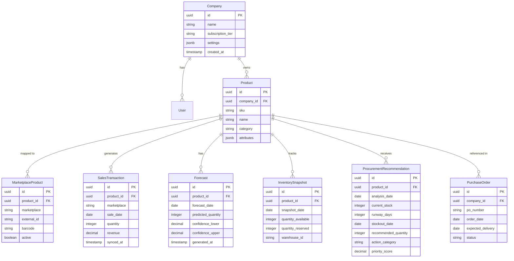

# StockPredictor - Inventory Management & Demand Forecasting SaaS

## Project Vision

StockPredictor is a comprehensive monolithic SaaS platform that automates inventory control, demand forecasting, and procurement planning for marketplace sellers. The system eliminates manual routine by providing automated, data-driven recommendations that prevent stockouts and optimize purchasing decisions.

## Business Context

### Problem Statement

Marketplace sellers face critical challenges in inventory management:
- Inability to predict when specific products will run out of stock
- Uncertainty about optimal order quantities
- Lack of visibility into which items require immediate attention
- Lost revenue due to stockouts and chaotic purchasing decisions

### Value Proposition

StockPredictor provides an automated solution that:
- Integrates with major marketplaces (Wildberries, Ozon) to automatically sync sales and inventory data
- Forecasts demand using machine learning models
- Generates actionable procurement recommendations
- Delivers a daily dashboard showing critical, controlled, and attention-required items

### Target Users

- Marketplace sellers managing inventory across multiple platforms
- Procurement specialists responsible for purchase planning
- E-commerce entrepreneurs seeking to optimize stock levels

## System Architecture Overview

### Architectural Style

Monolithic architecture with clear modular separation, designed for scalability without the complexity of microservices.

### Technology Foundation

| Component | Technology | Purpose |
|-----------|-----------|---------|
| Web Framework | Django | User interface, authentication, data management, dashboard delivery |
| Task Queue | Celery | Asynchronous processing of marketplace synchronization and forecast calculations |
| Database | PostgreSQL | Single unified database with multi-tenancy support |
| ML Engine | XGBoost | Demand forecasting model |
| Caching | Redis (implied by Celery) | Task queue broker and result backend |

### Multi-Tenancy Design

The system implements logical data isolation through a company-based partitioning strategy:

- All entities are linked to `company_id`
- Each company operates in its own logical namespace within the shared database
- Data isolation ensures security and scalability without infrastructure duplication

## Core Domain Modules

### 1. Accounts Module

**Purpose**: Manage user authentication, authorization, and company accounts.

**Key Responsibilities**:
- User registration and authentication
- Company profile management
- Multi-tenancy enforcement through company_id
- Subscription and access control

**Key Entities**:

| Entity | Description | Key Attributes |
|--------|-------------|----------------|
| User | System user account | email, password, company_id, role |
| Company | Tenant organization | name, subscription_tier, settings |
| Permission | Access control rules | user_id, resource, action |

### 2. Product Catalog Module

**Purpose**: Maintain unified product catalog across all marketplace integrations.

**Key Responsibilities**:
- Store product master data
- Map products from different marketplaces to unified SKU format
- Track product metadata and categorization
- Support multi-marketplace product variants

**Key Entities**:

| Entity | Description | Key Attributes |
|--------|-------------|----------------|
| Product | Master product record | sku, name, category, company_id |
| MarketplaceProduct | Platform-specific product mapping | product_id, marketplace, external_id, barcode |
| ProductAttributes | Additional product metadata | product_id, brand, dimensions, weight |

### 3. Sales Module

**Purpose**: Store and manage historical sales data from all integrated marketplaces.

**Key Responsibilities**:
- Record daily sales transactions
- Track sales velocity and trends
- Provide historical data for forecasting
- Support sales analytics and reporting

**Key Entities**:

| Entity | Description | Key Attributes |
|--------|-------------|----------------|
| SalesTransaction | Individual sale record | product_id, marketplace, quantity, date, revenue |
| DailySalesAggregate | Pre-aggregated daily sales | product_id, date, total_quantity, total_revenue |
| SalesHistory | Time-series sales data | product_id, date, quantity, company_id |

### 4. Integrations Module

**Purpose**: Connect with external marketplace APIs and synchronize data.

**Key Responsibilities**:
- Authenticate with marketplace APIs
- Fetch sales and inventory data
- Transform external data formats to internal schema
- Handle API rate limits and error recovery
- Schedule periodic synchronization tasks

**Architecture Pattern**:

**Key Components**:

| Component | Purpose | Responsibilities |
|-----------|---------|------------------|
| WildberriesClient | API communication | Authenticate, fetch sales/inventory, handle pagination |
| OzonClient | API communication | Authenticate, fetch sales/inventory, handle pagination |
| DataMapper | Data transformation | Convert marketplace formats to internal schema |
| SyncOrchestrator | Coordination | Schedule syncs, handle failures, log results |

**Data Flow**:

1. Celery scheduler triggers periodic sync task (e.g., daily at 6 AM)
2. Task determines which marketplaces are configured for the company
3. Appropriate client fetches data from marketplace API
4. Mapper transforms external format to internal schema
5. Data is validated and stored in PostgreSQL
6. Sync status and metrics are logged

### 5. Forecasting Module

**Purpose**: Generate demand forecasts using machine learning models.

**Key Responsibilities**:
- Prepare feature engineering pipeline
- Train and update XGBoost models per product
- Generate daily demand forecasts
- Calculate forecast accuracy metrics
- Store prediction results

**ML Pipeline Architecture**:

**Feature Engineering Strategy**:

| Feature Category | Examples | Purpose |
|-----------------|----------|---------|
| Lag Features | sales_lag_1, sales_lag_7, sales_lag_30 | Capture recent trends |
| Rolling Statistics | rolling_mean_7, rolling_mean_30, rolling_std_7 | Smooth seasonality |
| Calendar Features | day_of_week, is_weekend, month, is_holiday | Identify temporal patterns |
| Promotion Features | is_promo, discount_percentage | Account for marketing events |
| Trend Features | days_since_launch, growth_rate | Capture product lifecycle |

**Model Training Strategy**:

- Individual models per SKU for personalized forecasting
- Training window: last 90-180 days of sales history
- Forecast horizon: 7-30 days ahead
- Model retraining frequency: weekly or when performance degrades
- Validation approach: time-series cross-validation

**Forecast Execution Flow**:

1. Celery task triggers forecast generation (e.g., daily at 7 AM after sync)
2. System retrieves historical sales data for all active products
3. Feature engineering pipeline constructs feature matrix
4. XGBoost model generates daily demand predictions for forecast horizon
5. Predictions are stored with confidence intervals
6. Forecast accuracy metrics are calculated and logged

### 6. Procurement Module

**Purpose**: Generate actionable procurement recommendations based on forecasts.

**Key Responsibilities**:
- Calculate inventory runway (days until stockout)
- Identify products requiring immediate orders
- Track existing purchase orders
- Categorize products into action lists
- Generate recommended order quantities

**Recommendation Logic**:

**Action List Categories**:

| List | Criteria | User Action |
|------|---------|-------------|
| Order Today | Inventory runway ≤ reorder threshold AND no covering PO | Place order immediately |
| Already Ordered | Existing PO fully covers forecasted demand | Monitor only |
| Attention Required | Edge cases: unusual demand spike, partial PO coverage, low confidence forecast | Review and decide |

**Recommendation Calculation**:

For each SKU, the system calculates:

| Metric | Formula | Purpose |
|--------|---------|---------|
| Daily Burn Rate | Average daily sales from recent history or forecast | Estimate consumption speed |
| Inventory Runway | Current stock ÷ Daily burn rate | Days until stockout |
| Stockout Date | Current date + Inventory runway | Predicted zero-stock date |
| Required Order Quantity | (Lead time + Safety stock period) × Daily burn rate - Current stock - In-transit PO | Optimal order amount |
| PO Coverage | Sum of in-transit PO quantities ÷ Forecasted demand over lead time | Coverage percentage |

**Configuration Parameters**:

| Parameter | Description | Typical Value |
|-----------|-------------|---------------|
| Reorder Threshold | Runway days triggering reorder alert | 7-14 days |
| Lead Time | Days from order to delivery | 14-30 days (marketplace-specific) |
| Safety Stock Period | Buffer days beyond lead time | 3-7 days |
| Minimum Order Quantity | Smallest viable order size | Product-specific |

## Data Processing Workflows

### Daily Operations Workflow

### Forecast Generation Workflow

### Procurement Recommendation Workflow

## Data Model Overview

### Core Entity Relationships

### Key Data Constraints

| Constraint Type | Application | Purpose |
|----------------|-------------|---------|
| Company Isolation | All entities include company_id | Enforce multi-tenancy |
| Unique SKU per Company | (company_id, sku) unique | Prevent duplicate products |
| Marketplace Product Mapping | (product_id, marketplace) unique | One mapping per platform |
| Forecast Uniqueness | (product_id, forecast_date) unique | No duplicate predictions |
| Temporal Integrity | All dates indexed and validated | Support time-series queries |

## User Interface & Experience

### Morning Dashboard

The primary user interface is a daily dashboard delivered each morning, providing at-a-glance visibility into inventory status.

**Dashboard Sections**:

| Section | Content | Purpose |
|---------|---------|---------|
| Order Today | SKUs requiring immediate orders, sorted by urgency | Drive immediate action |
| Already Ordered | SKUs with active POs covering demand | Provide confidence |
| Attention Required | SKUs with edge cases or anomalies | Flag for manual review |
| Summary Metrics | Total SKUs, stockout risk count, forecast accuracy | High-level health check |

**Data Presentation per SKU**:

| Field | Description | User Value |
|-------|-------------|------------|
| Product Name | SKU identifier and name | Recognize product |
| Current Stock | Available inventory quantity | Understand current position |
| Runway Days | Days until stockout | Gauge urgency |
| Stockout Date | Predicted zero-stock date | Plan timeline |
| Recommended Order | Suggested order quantity | Simplify decision |
| Forecast Confidence | Model confidence level | Assess reliability |
| Recent Sales Trend | Visual indicator of trend | Spot anomalies |

**Interaction Patterns**:

- Click SKU to view detailed forecast chart and sales history
- Mark items as "ordered" to move to Already Ordered list
- Flag items for manual review with notes
- Export recommendations to CSV for procurement systems
- Adjust reorder thresholds per product

### Additional Views

| View | Purpose | Key Features |
|------|---------|--------------|
| Product Catalog | Manage products and marketplace mappings | Add/edit products, sync status |
| Sales Analytics | Analyze historical sales performance | Charts, filters, export |
| Forecast Performance | Monitor ML model accuracy | Metrics, model versions |
| Purchase Orders | Track order status and delivery | PO list, status updates |
| Integration Settings | Configure marketplace API credentials | API keys, sync schedules |

## System Behavior & Business Rules

### Inventory Management Rules

| Rule | Condition | Action |
|------|-----------|--------|
| Stockout Alert | Inventory runway ≤ threshold | Add to Order Today list |
| Low Confidence Warning | Forecast confidence < 70% | Add to Attention Required list |
| Demand Spike Detection | Current sales > 2× forecast | Flag for review |
| Dormant Product | No sales for 30+ days | Exclude from forecasting |
| New Product Handling | < 30 days of sales history | Use category average or manual input |

### Forecast Validation Rules

| Rule | Purpose | Implementation |
|------|---------|----------------|
| Minimum History Requirement | Ensure sufficient data | Require 30+ days of sales before forecasting |
| Outlier Detection | Prevent model bias | Remove or cap extreme values in training data |
| Seasonality Adjustment | Account for patterns | Include calendar features and seasonal decomposition |
| Confidence Thresholds | Communicate uncertainty | Calculate prediction intervals, flag low confidence |

### Synchronization Rules

| Rule | Purpose | Configuration |
|------|---------|---------------|
| Daily Sync Schedule | Keep data fresh | Run at 6 AM daily before forecasting |
| Error Retry Strategy | Handle API failures | 3 retries with exponential backoff |
| Rate Limit Handling | Respect API limits | Implement throttling per marketplace requirements |
| Delta Sync Optimization | Reduce API load | Fetch only new data since last sync when supported |

## Scalability & Performance Considerations

### Performance Optimization Strategies

| Strategy | Application | Expected Benefit |
|----------|-------------|------------------|
| Database Indexing | company_id, product_id, date fields | Fast multi-tenant queries |
| Materialized Aggregates | Pre-compute daily sales summaries | Reduce forecast preparation time |
| Celery Task Distribution | Parallel forecast generation per SKU | Horizontal scaling capability |
| Query Optimization | Avoid N+1 queries in dashboard | Sub-second dashboard load |
| Caching Layer | Cache dashboard data for 1 hour | Reduce database load during peak hours |

### Scalability Design

**Current Scale Target**: 

- 100-500 companies
- 1,000-10,000 SKUs per company
- 90 days of historical data per SKU
- Daily forecast generation

**Growth Path**:

| Growth Stage | Characteristics | Required Adjustments |
|--------------|----------------|---------------------|
| Stage 1 (Current) | Single server deployment | None - current architecture sufficient |
| Stage 2 | 500-1000 companies | Add read replicas, increase Celery workers |
| Stage 3 | 1000+ companies | Partition large tables by company_id, add database sharding |
| Stage 4 | Enterprise scale | Consider decomposing into bounded contexts if needed |

### Resource Allocation

| Process | Frequency | Estimated Duration | Resource Intensity |
|---------|-----------|-------------------|-------------------|
| Marketplace Sync | Daily | 10-30 minutes per company | I/O bound - network and database writes |
| Forecast Generation | Daily | 1-5 seconds per SKU | CPU bound - model inference |
| Procurement Analysis | Daily | < 1 minute per company | Database bound - joins and aggregations |
| Dashboard Rendering | On-demand | < 1 second | Cache-optimized |

## Integration Specifications

### Wildberries Integration

**API Endpoints Used**:

| Endpoint | Purpose | Data Retrieved |
|----------|---------|----------------|
| Sales Report API | Fetch sales transactions | date, sku, quantity, revenue |
| Stock API | Fetch current inventory | sku, warehouse, available_qty, reserved_qty |
| Product API | Sync product catalog | sku, name, barcode, category |

**Authentication**: API token-based authentication stored securely per company

**Data Mapping**:

| Wildberries Field | Internal Field | Transformation |
|------------------|----------------|----------------|
| nmId | external_id | Direct mapping |
| barcode | barcode | Direct mapping |
| quantity | quantity | Direct mapping |
| realizationreport_id | transaction_reference | Store for idempotency |

**Sync Strategy**: Full sync of last 90 days, then incremental daily updates

### Ozon Integration

**API Endpoints Used**:

| Endpoint | Purpose | Data Retrieved |
|----------|---------|----------------|
| Analytics Report | Fetch sales data | date, offer_id, quantity, revenue |
| Stocks API | Fetch inventory levels | offer_id, warehouse, present, reserved |
| Product Info | Sync product details | offer_id, name, sku, category |

**Authentication**: Client ID and API key stored per company

**Data Mapping**:

| Ozon Field | Internal Field | Transformation |
|-----------|----------------|----------------|
| offer_id | external_id | Direct mapping |
| sku | barcode | Direct mapping |
| quantity | quantity | Direct mapping |
| created_at | sale_date | Convert to date |

**Sync Strategy**: API supports date filtering, fetch data from last sync timestamp

### Error Handling Strategy

| Error Type | Detection | Recovery Action |
|------------|-----------|----------------|
| Authentication Failure | HTTP 401/403 | Notify company admin, pause sync until credentials updated |
| Rate Limit Exceeded | HTTP 429 | Exponential backoff, resume after cooldown period |
| API Timeout | Network timeout | Retry up to 3 times, log failure, alert on repeated failures |
| Data Format Change | Validation error | Log sample, alert developers, use fallback mapping |
| Partial Data | Incomplete response | Save partial data, flag for manual review, retry missing segments |

## Security & Compliance

### Data Security Measures

| Layer | Measure | Purpose |
|-------|---------|---------|
| Authentication | Django authentication with password hashing | Secure user access |
| Authorization | Role-based access control per company | Enforce permissions |
| Data Isolation | company_id filtering in all queries | Prevent cross-tenant data leaks |
| API Credentials | Encrypted storage of marketplace tokens | Protect third-party access |
| HTTPS Enforcement | SSL/TLS for all communications | Encrypt data in transit |
| Database Access | Restricted connection credentials | Limit database exposure |

### Data Privacy

| Principle | Implementation |
|-----------|----------------|
| Data Ownership | Each company owns their data, accessible only to their users |
| Data Retention | Sales and forecast data retained for 1 year, then archived |
| Data Export | Users can export all their data on demand |
| Data Deletion | Company deletion removes all associated data within 30 days |

### Audit & Monitoring

| Activity | Logging Strategy | Purpose |
|----------|-----------------|---------|
| API Sync Operations | Log timestamp, company, marketplace, record count, errors | Debug integration issues |
| Forecast Generation | Log model version, SKU count, average accuracy, failures | Monitor ML performance |
| User Actions | Log critical actions (product changes, setting updates) | Support troubleshooting |
| System Errors | Centralized error logging with stack traces | Facilitate debugging |

## Operational Considerations

### Monitoring & Alerting

**Key Metrics to Monitor**:

| Metric | Threshold | Alert Action |
|--------|-----------|--------------|
| Sync Success Rate | < 95% | Alert operations team |
| Forecast Generation Completion | < 100% daily | Investigate failures |
| Dashboard Load Time | > 3 seconds | Optimize queries or add caching |
| Celery Queue Depth | > 1000 pending tasks | Scale workers or investigate bottleneck |
| Database Connection Pool | > 80% utilization | Increase pool size or optimize queries |
| API Error Rate | > 5% | Check marketplace API status |

### Maintenance Procedures

| Task | Frequency | Purpose |
|------|-----------|---------|
| Model Retraining | Weekly | Keep forecasts accurate with recent patterns |
| Database Vacuum | Weekly | Optimize PostgreSQL performance |
| Log Rotation | Daily | Manage disk space |
| Backup Verification | Weekly | Ensure recovery capability |
| Dependency Updates | Monthly | Security patches and improvements |

### Disaster Recovery

| Scenario | Recovery Strategy | RTO/RPO Target |
|----------|------------------|----------------|
| Database Failure | Restore from daily backup | RTO: 4 hours, RPO: 24 hours |
| Application Crash | Restart services, check logs | RTO: 15 minutes, RPO: 0 |
| Data Corruption | Restore affected company data from backup | RTO: 2 hours, RPO: 24 hours |
| Marketplace API Outage | Queue requests, retry when service restored | Graceful degradation |

## Future Enhancement Opportunities

### Potential Feature Additions

| Feature | Business Value | Technical Complexity |
|---------|----------------|---------------------|
| Multi-product bundle forecasting | Better capture cross-sell patterns | Medium - requires correlated forecasting |
| Supplier integration | Automate PO placement | Medium - new integration layer |
| Price optimization | Maximize profit margins | High - requires pricing models |
| Promotion planning | Optimize marketing spend | Medium - extend forecast features |
| Mobile app | On-the-go alerts and approvals | Medium - new frontend |
| Advanced analytics | Deeper business insights | Low - leverage existing data |

### Architectural Evolution

The current monolithic architecture is well-suited for the defined scope and scale. Future architectural considerations:

**When to consider decomposition**:
- Company count exceeds 5,000 with diverse needs
- Feature complexity grows significantly beyond core forecasting
- Team size exceeds 20 developers requiring independent deployment

**Potential bounded contexts if decomposition needed**:
- Identity & Access Management
- Marketplace Integration Engine
- Forecasting & ML Platform
- Procurement & Inventory Management

## Success Metrics

### Business KPIs

| Metric | Definition | Target |
|--------|------------|--------|
| Stockout Prevention Rate | % of stockouts prevented vs. baseline | > 80% |
| Forecast Accuracy | MAPE across all products | < 20% |
| User Engagement | % of users logging in daily | > 70% |
| Order Recommendation Acceptance | % of recommendations acted upon | > 60% |
| Time Saved per User | Hours saved monthly vs. manual process | > 10 hours |

### Technical KPIs

| Metric | Definition | Target |
|--------|------------|--------|
| System Uptime | % availability during business hours | > 99.5% |
| Sync Success Rate | % of scheduled syncs completing successfully | > 98% |
| Dashboard Load Time | P95 load time for morning dashboard | < 2 seconds |
| Forecast Coverage | % of active SKUs with valid forecasts | > 95% |
| API Error Rate | % of marketplace API calls failing | < 2% |

## Dependencies & Constraints

### External Dependencies

| Dependency | Type | Risk Mitigation |
|------------|------|-----------------|
| Wildberries API | Data source | Monitor API status, implement retry logic, alert on extended outages |
| Ozon API | Data source | Same as Wildberries |
| PostgreSQL | Data storage | Regular backups, replication for high availability |
| Celery/Redis | Task processing | Monitor queue health, auto-restart on failure |

### Technical Constraints

| Constraint | Impact | Mitigation |
|------------|--------|------------|
| Marketplace API rate limits | Limits sync frequency | Respect rate limits, use delta syncs when possible |
| Historical data availability | Forecast quality for new products | Use category averages for cold start |
| Model training time | Limits model complexity | Use efficient algorithms like XGBoost, parallelize training |
| Single database | Potential bottleneck at scale | Optimize queries, add read replicas, plan for sharding |

### Business Constraints

| Constraint | Implication |
|------------|-------------|
| Lead times vary by marketplace | Recommendations must be configurable per marketplace |
| Minimum order quantities | Recommendations must respect MOQ constraints |
| Warehouse capacity | Future feature: consider storage limits in recommendations |
| Budget limitations | Prioritize high-ROI features, defer nice-to-haves |

## Glossary

| Term | Definition |
|------|------------|
| SKU | Stock Keeping Unit - unique product identifier |
| Inventory Runway | Number of days until current stock reaches zero |
| Stockout | Situation where product inventory reaches zero |
| Reorder Threshold | Runway days triggering order recommendation |
| Lead Time | Days from order placement to delivery |
| Safety Stock | Buffer inventory to protect against demand variability |
| PO | Purchase Order - order placed with supplier |
| MAPE | Mean Absolute Percentage Error - forecast accuracy metric |
| Marketplace | E-commerce platform (Wildberries, Ozon) |
| Multi-tenancy | Architecture supporting multiple companies in shared system || Marketplace | E-commerce platform (Wildberries, Ozon) |
